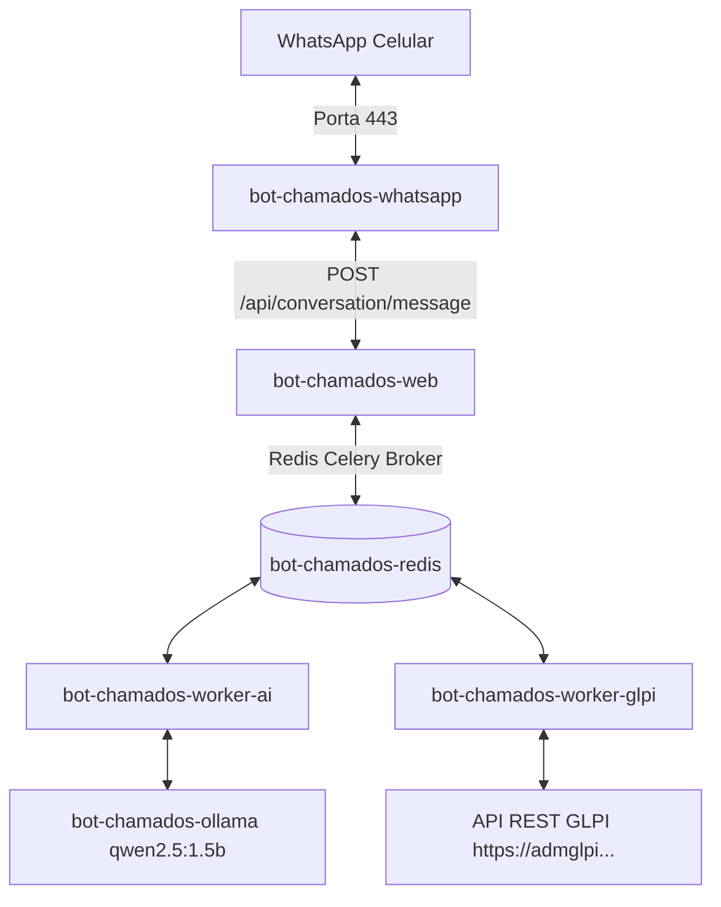

# 🚀 Manual de Deploy SSH, Arquitetura Proxmox e Diagnóstico de CPF (Ponto de Atenção)

Este documento foi elaborado para registrar todo o processo de deploy automatizado via SSH no container LXC do Proxmox, a arquitetura de alta performance implementada e a análise técnica cirúrgica do problema não sanado de validação do CPF.

---

## 📂 Localização deste Documento
* **Caminho no Projeto:** `docs/DEPLOY_AND_TROUBLESHOOTING.md` (Este arquivo está integrado ao repositório para consulta rápida de qualquer Desenvolvedor ou IA).

---

## 🛠️ 1. Histórico de Infraestrutura & Deploy do Zero no Proxmox

O deploy remoto do bot no container LXC (`192.168.2.110`) foi estruturado de forma 100% resiliente usando scripts de orquestração local em Python e execução bash no host remoto via biblioteca **Paramiko**.

### A. Fluxo de Deploy Local -> Remoto (`deploy_via_ssh.py`)
1. **Compactação:** O script local gera o arquivo compacto `bot.tar.gz` contendo todo o código-fonte, excluindo ambientes virtuais e cache.
2. **Transferência SCP:** Abre uma sessão SFTP segura via SSH (`root@192.168.2.110`) e envia os arquivos `bot.tar.gz`, `.env.docker` e `remote-deploy.sh`.
3. **Extração Remota:** Descompacta o código-fonte diretamente em `/opt/bot-chamados-glpi/` de forma limpa.
4. **Instalação e Orquestração:** Executa o script remetente `/tmp/remote-deploy.sh` que garante a instalação do Docker, configura a rede e sobe os containers em background.

### B. Otimização Crítica do Storage Driver (Resolução do Estouro de Disco)
* **O Problema Inicial:** O container LXC possui limitação de 30 GB de disco. Anteriormente, o Docker estava configurado com o driver de armazenamento legado `vfs` (ou `fuse-overlayfs`). O `vfs` duplica fisicamente todos os arquivos do container (faz cópias brutas de 4 GB do Ollama e 1 GB de Python para cada serviço como `web`, `worker-ai`, `worker-glpi`), o que esgotou os 30 GB de disco instantaneamente.
* **A Solução Definitiva:** Aproveitando que o LXC no Proxmox do cliente tem a permissão de **Nesting ativa**, removemos a configuração forçada do `/etc/docker/daemon.json` e limpamos o cache de disco antigo. Isso permitiu ao Docker carregar o driver nativo **`overlayfs`**.
  * **Resultado:** O espaço em disco usado caiu de **100% (Full)** para apenas **6% (27 GB livres!)**, com builds e deploys que levavam 15 minutos rodando agora em **20 segundos** devido ao cacheamento inteligente de camadas compartilhadas.

---

## 🧩 2. Arquitetura da Aplicação Rodando no Docker (LXC)

A aplicação foi orquestrada no arquivo `compose.yml` dividindo as responsabilidades de forma assíncrona para evitar travamentos de tela por lentidão da IA:



1. **`bot-chamados-redis`:** Banco Redis para persistência de estado e fila de tarefas do Celery.
2. **`bot-chamados-ollama`:** Processamento local de Inteligência Artificial usando o modelo leve `qwen2.5:1.5b`.
3. **`bot-chamados-web`:** API FastAPI (cérebro do bot) responsável pelo controle de estados e validações de identidade.
4. **`bot-chamados-worker-ai` / `bot-chamados-worker-glpi`:** Workers Celery que processam tarefas pesadas (geração de respostas de IA e conexões externas com o GLPI) de forma assíncrona sem travar o WhatsApp.
5. **`bot-chamados-whatsapp`:** Conector Go que ouve as mensagens recebidas e faz a ponte via API Web.

---

## 🔍 3. O Problema Não Sanado: Falha na Validação de CPF no WhatsApp Real

Mesmo com o Health Check da API retornando **100% Saudável e Conectado em Modo Real** (`status: ok`), as tentativas de CPF digitadas pelo usuário do número `66999990980` retornam erro de validação.

Analisando cirurgicamente a classe `GLPIRealUserIdentityLookupService`, identificamos as duas possíveis causas do comportamento inesperado:

### 🔬 Causa Raiz A: Divergência no Campo de CPF cadastrado no GLPI
No arquivo `app/authentication_and_identity/glpi_user_identity_lookup_service.py`, a propriedade `registration_number` (CPF) é mapeada dinamicamente pelo buscador de opções do GLPI pelo seguinte critério:
```python
"registration_number": resolver.require_one(
    fields=("registration_number",),
    names=("Administrative number", "Registration number", "Matricula"),
)
```
* **O Problema:** O bot assume que o CPF do usuário está cadastrado no campo padrão do GLPI chamado **"Administrative number"**, **"Registration number"** ou **"Matricula"**. Se na sua instalação do GLPI o CPF do Pedro estiver salvo em um **Campo Personalizado (Custom Field / Plugin Fields)**, o bot lerá o campo padrão como vazio (`""`). Como vazio não bate com os primeiros dígitos digitados, a validação falha sempre.

### 🔬 Causa Raiz B: Formato de Telefone incompatível no GLPI
A busca inicial do usuário é filtrada estritamente pelo número de celular do WhatsApp:
```python
target_variants = set(ChannelIdentifierNormalizer.phone_variants(phone))
```
O bot gera variações com e sem o nono dígito do Brasil (Ex: `66999990980`, `6699990980`). 
* **O Problema:** Se no banco de dados do seu GLPI o telefone do Pedro estiver cadastrado com formatações atípicas (como espaços duplos, ausência do DDD `66`, ou texto adicional), a pesquisa do GLPI retornará **zero registros**, fazendo o bot acreditar que o usuário não existe para aquele telefone.

---

## 🛠️ Como o Próximo Agente (ou Você) deve debugar e resolver:

1. **Inspeção de Payload do GLPI:**
   * Crie um script temporário para fazer um `GET` direto no endpoint de busca de usuários do GLPI:
     `https://admglpi.terrapremium.com.br/apirest.php/User/` buscando pelo ID do seu usuário Pedro para ver qual é a chave exata onde o CPF está armazenado no JSON retornado.
2. **Ajuste de Mapeamento:**
   * Se o CPF estiver em um campo customizado (ex: `custom_field_cpf` ou ID de campo específico), ajuste a função `_resolve_user_fields` em `glpi_user_identity_lookup_service.py` para apontar diretamente para esse ID de campo.

---

## 🤝 Histórico de Comandos Úteis no Console Remoto

Caso precise interagir diretamente no terminal do servidor LXC:

* **Ver Logs do WhatsApp em tempo real:**
  ```bash
  docker compose -f /opt/bot-chamados-glpi/compose.yml logs -f whatsapp
  ```
* **Ver Logs do Servidor Web (Busca do GLPI):**
  ```bash
  docker compose -f /opt/bot-chamados-glpi/compose.yml logs -f web
  ```
* **Zerar os Bloqueios e Estados do Redis (Desbloquear telefone):**
  ```bash
  docker exec bot-chamados-redis redis-cli FLUSHALL
  ```
* **Verificar Espaço em Disco Remoto:**
  ```bash
  df -h
  ```
