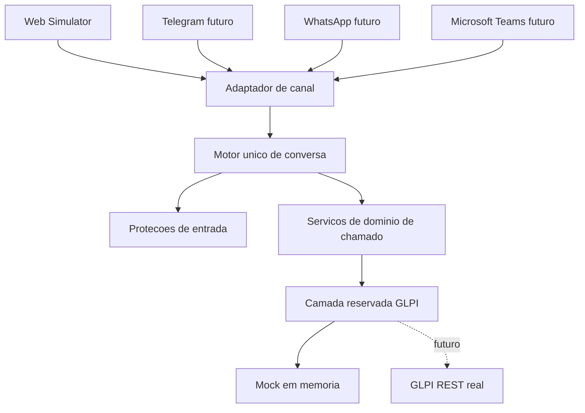

# Visao de arquitetura

O projeto separa canal, conversa, dominio, triagem, seguranca, persistencia simulada e fronteira GLPI.

Os canais nao possuem regra de negocio. A troca de canal deve preservar o mesmo fluxo e os mesmos servicos.

